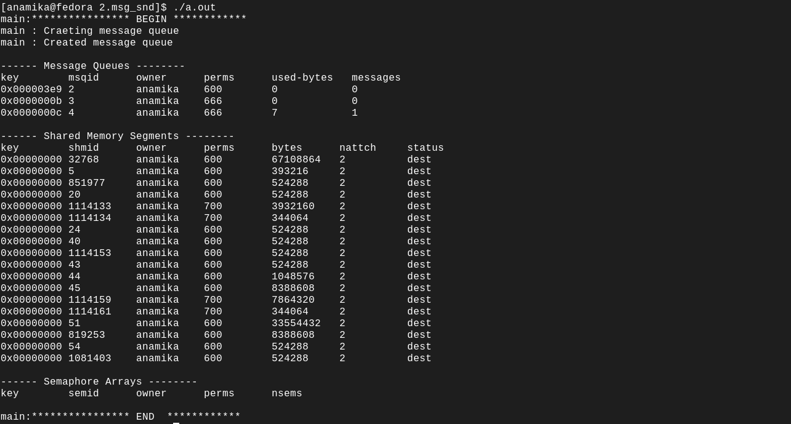

Usage of msgsnd

       
 The  msgsnd()  and msgrcv() system calls are used to send messages to, and receive messages from, a System V message queue.  The calling process must have write permission on the message queue in order to send a message, and read permission to receive a message.

int msgsnd(int msqid, const void *msgp, size_t msgsz, int msgflg);

msqid : It the key defined by developer for the message queue that was returned ny msgget().

size_t msgsz: Size of the payload , does not include type long.

int msgflg: 0 for default : Blocking IO
            IPCNOWAIT : No blocking IO
 
const void *msgp   

 pointer to a caller-defined structure of the following general form:

           struct msgbuf {
               long mtype;       /* message type, must be > 0 */
               char mtext[1];    /* message data */
           };

       The mtext field is an array (or other structure) whose size is specified by msgsz, a nonnegative integer value.  Messages of zero length (i.e., no  mtext  field)  are  permitted.
       The mtype field must have a strictly positive integer value.  This value can be used by the receiving process for message selection (see the description of msgrcv() below).

RETURN VALUE
       On success, msgsnd() returns 0 and msgrcv() returns the number of bytes actually copied into the mtext array.  On failure, both functions return -1, and set errno to indicate the
       error.

Shows a msgqueue created with ID :12 (provided by developer) having size of 7, holding one message.

