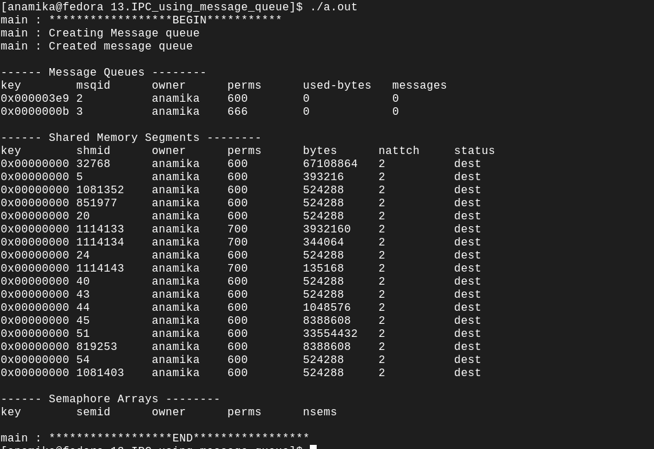

Creating message queue using system call msgget

int msgget(key_t key, int msgflg);

The  msgget() system call returns the System V message queue identifier associated with the value of the key argument.

key_t key : key provided by developer to indentify the message queue.
            It is only used to craete msg queue.
            Example : (key_t)10
                   A new message queue is created if key has the value IPC_PRIVATE or key isn't IPC_PRIVATE, no message queue with the given key key exists, and IPC_CREAT is specified in msgflg.

int msgflg :  If msgflg specifies both IPC_CREAT and IPC_EXCL and a message queue already exists for key, then msgget() fails with errno set to EEXIST.  (This is analogous to the effect of t              he combination O_CREAT | O_EXCL for open(2).)

        Upon  creation,  the  least  significant bits of the argument msgflg define the permissions of the message queue.  These permission bits have the same format and semantics as the
       permissions specified for the mode argument of open(2).  (The execute permissions are not used.)

        Example : 0666| IPC_CREAT

Retrun Value
       On success, msgget() returns the message queue identifier (a nonnegative integer).  On failure, -1 is returned, and errno is set to indicate the error.

Expected Output

